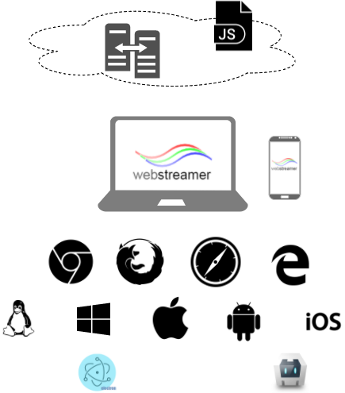

# Webstreamer
<table>
  <tr>
    <td align="left">
    
    </td>
    <td>
    <td color="gray" align="right">
    <a href="http://www.kedacom.com">
    webstreamer is a project of KEDACOM
    </td>
  </tr>
</table>

Welcome to WebStreamer, a full stack solution for multimedia application. We focus on multimeida software development and operations to facilitate more rapid of your business growth.

Our vision is to write once, render anywhere.

# Status

After more than a years investiagation and verification, we have a prototype for reatime (with WebRTC) and live (HLS) media system to proof the concept. For now, we have almost near end of the POC (proof of concept) and coming into MVP (minimum viable product) plan work.

The features of MVP details please see [epics](./epics/README.md)

