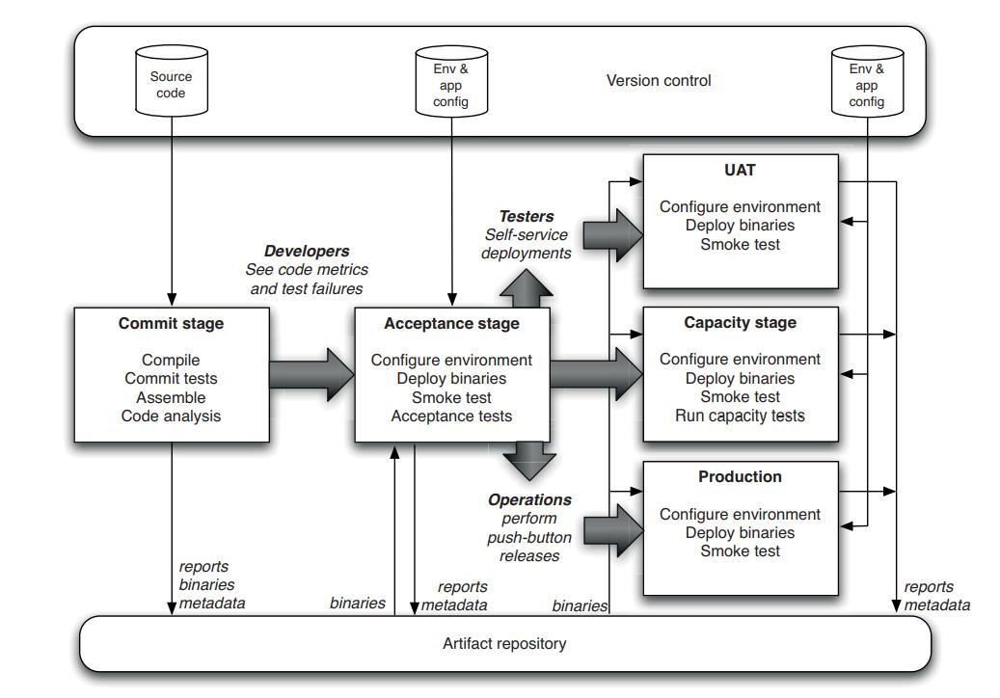
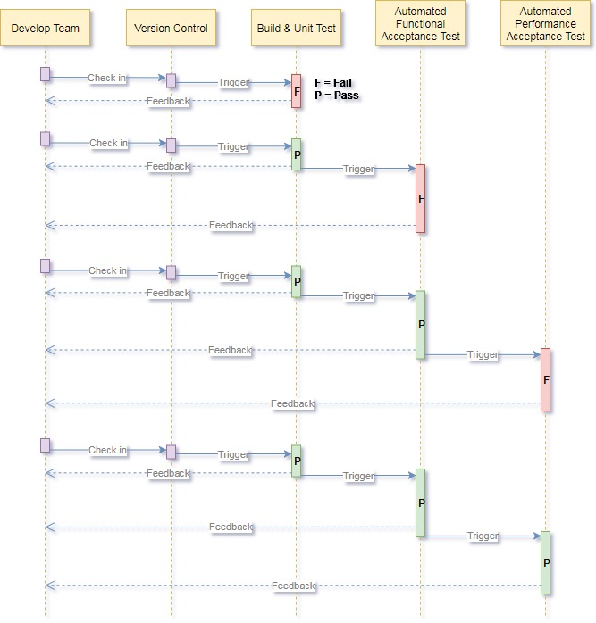
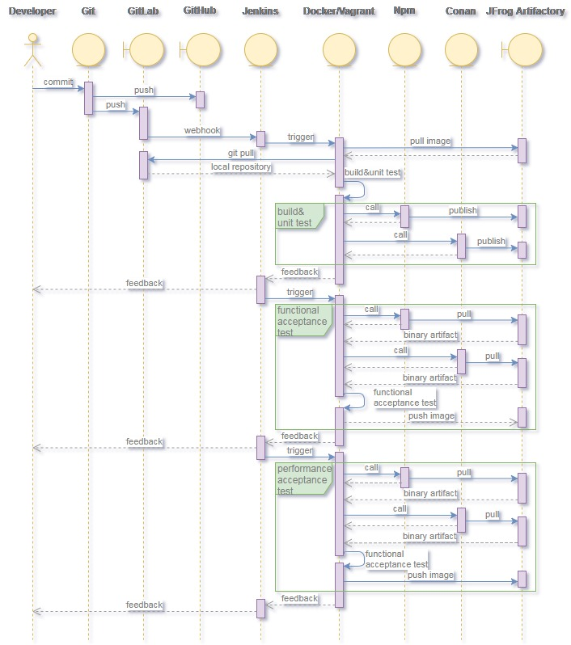
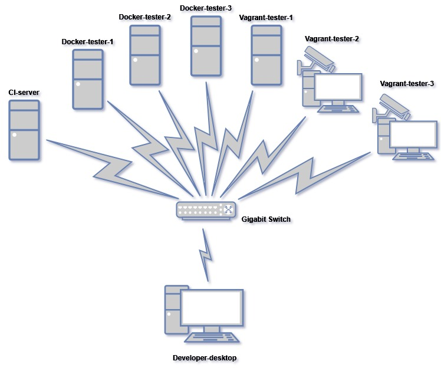

# WebStreamer DevOps Design
## DevOps deployment pipeline

## DevOps workflow

## DevOps best practice

> Toolset as follows:
> 1. [Git](https://git-scm.com/) : Free and open-source distributed version control system
> 2. [GitHub](https://github.com/) : A web-based hosting service for version control using Git
> 3. [Jenkins](https://jenkins.io/) : The leading open-source automation server for CI/CD
> 4. [npm](https://www.npmjs.com/) : JavaScript package manager
> 5. [Conan](https://conan.io/) : C/C++ open-source package manager
> 6. [Docker](https://www.docker.com/) : Container platform
> 7. [Vagrant](https://www.vagrantup.com/) : Virtual machine manager
> 8. [Gitlab](https://about.gitlab.com/) : A self-hosted web-based Git-repository manager
> 9. [JFrog Artifactory](https://jfrog.com/artifactory/) : Enterprise Universal Repository Manager
> 10. [VirtualBox](https://www.virtualbox.org/) : Free and open-source hypervisor or virtual machine monitor for x86 computers

## DevOps environment setup
### 1. Hardware configuration

### 2. Software configuration matrix
Software installed \ Computers | CI-server | Docker-tester-1/2/3 | Vagrant-tester-1 | Vagrant-tester-2 | Vagrant-tester-3
-------------------------------|:---------:|:-------------------:|:------:|:-------:|:----:
__Operating System__|||||
Windows 7 Service Pack 1|__*__|||__*__|__*__
ubuntu-16.04.5-server||__*__|__*__||
__Tools__|||||
Jenkins 2.121.3|__*__|__*__|__*__|__*__|__*__
JFrog Artifactory Pro 6.2.0|__*__||||
Java SE Development Kit 8u181|__*__||||
Gitlab CE 11.1.4|__*__||||
Git 2.18.0|__*__||||
Docker CE 18.03.0||__*__|||
Vagrant 2.1.1|||__*__|__*__|__*__
VirtualBox 5.2.12|||__*__|__*__|__*__
Windows PowerShell 3.0||||__*__|__*__

> Each server's role lists as follows:
> - CI-server : Jenkins server, JFrog Artifactory server, GitLab repository
> - Docker-tester-1/2/3 : Linux build and test machines via Docker images
> - Vagrant-tester-1 : Windows build and test machine via Vagrant boxes
> - Vagrant-tester-2 : Windows GUI test machine via Vagrant boxes
> - Vagrant-tester-3 : Linux GUI test machine via Vagrant boxes

## Docker image and vagrant box configuration matrix
### General configuration matrix
Software installed \ Docker image(D) or Vagrant box(V) | Ubuntu-server(D) | Ubuntu-desktop(V) | Windows(V) | Conan(D)
:------------------------------------------------------|:----------------:|:----------------:|:----------:|:--------:
__Operation System__||||
Ubuntu ( Desktop )||__*__||
Ubuntu ( Server )|__*__|||
Windows|||__*__|
__Tool Chain__||||
Windows PowerShell|||__*__|
.Net Framework|||__*__|
Visual Studio|||__*__|
Git|__*__|__*__|__*__|
Node.js|__*__|__*__|__*__|
Python|__*__|__*__|__*__|
CMake|__*__|__*__|__*__|
__Selenium__||||
Google ChromeDriver|__*__|__*__|__*__|
Firefox GeckoDriver|__*__|__*__|__*__|
__Web Browser__||||
Chrome|__*__|__*__|__*__|
Firefox|__*__|__*__|__*__|

### Docker image and vagrant box version control
#### Ubuntu-server(D)
Software installed \ Version | 0.1
:----------------------------|:----
Ubuntu ( Server )            | 16.04.5-server
Git                          | 2.18.0
Node.js                      | 10.9.0
Python                       | 2.7.15
CMake                        | 3.12.1
Google ChromeDriver          | 2.41
Firefox GeckoDriver          | 0.21.0
Chrome                       | 68.0
Firefox                      | 61.0.2

#### Ubuntu-desktop(V)
Software installed \ Version | 0.1
:----------------------------|:----
Ubuntu ( Desktop )           | 16.04.5-desktop
Git                          | 2.18.0
Node.js                      | 10.9.0
Python                       | 2.7.15
CMake                        | 3.12.1
Google ChromeDriver          | 2.41
Firefox GeckoDriver          | 0.21.0
Chrome                       | 68.0
Firefox                      | 61.0.2

#### Windows(V)
Software installed \ Version | 0.1
:----------------------------|:----
Windows                      | 7 Service Pack 1
Windows PowerShell           | 5.1
.Net Framework               | 4.7.2
Visual Studio                | 2017 CE
Git                          | 2.18.0
Node.js                      | 10.9.0
Python                       | 2.7.15
CMake                        | 3.12.1
Google ChromeDriver          | 2.41
Firefox GeckoDriver          | 0.21.0
Chrome                       | 68.0
Firefox                      | 61.0.2

Software installed \ Version | 0.2(amd64)
:----------------------------|:----
Windows                      | Server 2012 R2 Standard Build 9600
Windows SDK                  | Windows 10.0.17763.132
Visual Studio                | Community 2017
Git                          | 2.21.0
Python                       | 3.7.2
CMake                        | 3.13.4
Conan                        | 1.12.3
conan-package-tools          | 0.23.0

#### Conan(D)
Software installed \ Version | 0.1
:----------------------------|:----
