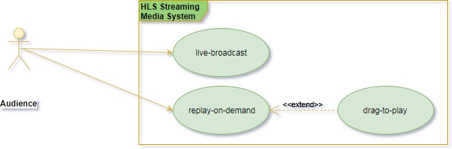
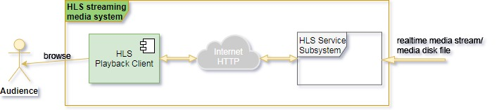
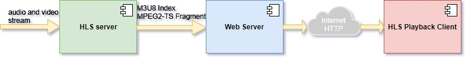
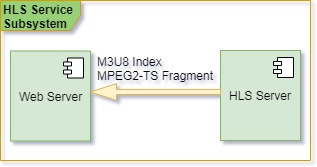
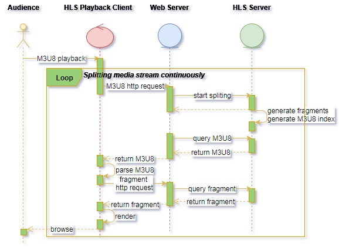
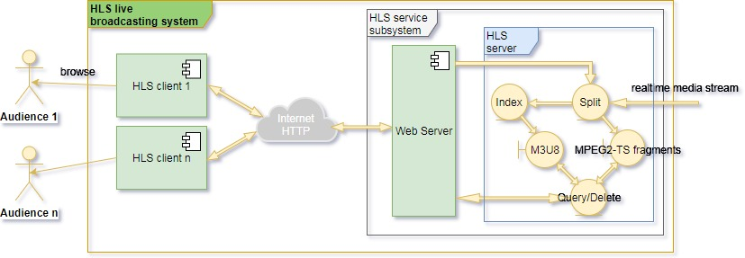
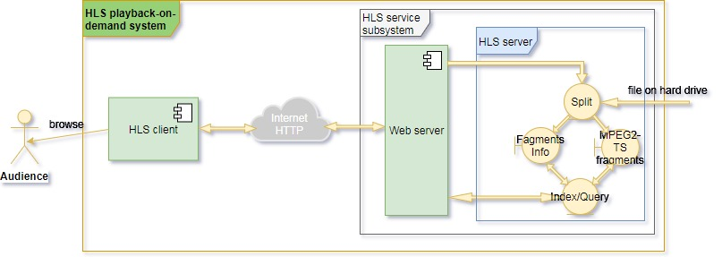

# Use case analysis of streaming media using HLS

## Introduction
With the universal application of mobile Internet and the continuous growth of online audio and video live broadcast and on-demand services in the past decade, streaming media technology has rapidly become a hot spot in the research and development of the industry. Native to Apple's iOS and MacOS system, HLS(Http Live Streaming) utilizes the Internet Web infrastructure to deliver audio and video content carried over HTTP protocol. Hence it's easy to deploy HLS to a variety of content distribution system, so that HLS has become a main-stream media-streaming technology and obtained widly application.

This document analyzes development requirements and main use case of the system based on HLS media-streaming technology in detail, as a guide and reference for the following detailed system design and software development.

## Requirement analysis
HLS streaming media system should be able to support audio and video live broadcast and on-demand services, and implement the function drag-to-play upon the basis of media-on-demand, as shown in the following figure.
> 

Live broadcast refers to the media generated in real time being delivered to the play client for browsing. Playback on demand refers to the media file stored on hard disk drives being read, demuxed and delivered to play. When doing playback on demand, audience usually likes to drag the process bar of the client software for playing, which is referred to __drag-to-play__.

Based on the above requirement, HLS media-streaming system typically has the system model as shown in the following figure.
> 

The following is a brief description of the HLS streaming technology. For the detailed specification, please refer to [RFC8216][].

## Introduction to HLS
HLS is a media-streaming technology that uses the HTTP protocol to carry and transmit audio and video content to the client software. Generally, the components of the HLS streaming system include the HLS server, the Web server and the HLS client, as shown in the following figure.
> 

According to the [requirement analysis](#requirement) above, the Web server and the HLS server form the HLS service subsystem together, as shown in the following figure.
> 

In the above schematic structure of HLS streaming system, the functions of each component are as follows:
* __HLS server__ : Continuously, splitting the input audio and video stream, outputing media fragments muxed by MPEG2-TS container format, and generating M3U8 index for the media fragments.
* __Web server__ : Continuously, distributing M3U8 index and MPEG2-TS muxing media fragments to the play client via the HTTP protocol.
* __HLS client__ : Firstly, continuously, requesting M3U8 index from Web server, and parsing the received M3U8 index carried over HTTP protocol. Secondly, continuously, requesting MPEG2-TS fragments as specified in M3U8 index, and rendering the media fragment received.

The general workflow of the system is shown in the figure below.
> 

The system implementation of __live-broadcast__, __playback-on-demand__ and __drag-to-play__ are covered in detail as following.

## Use case in detail
The main difference between live-broadcast and playback-on-demand is that the media content of live-broadcast service is generated in real time but for that of playback-on-demand service it's usually being the media file recorded and stored on hard drive. For live broadcast, audience can't play the past broadcasting elapsed, and generally there are many audiences watching the same live broadcasting in the meantime. But for playback on demand, it's a one-to-one service in the common sense, and the audience can drag the process bar of the client software to fast forward or rewind.

### Live broadcast
A typical HLS live broadcast system should have the system structure as shown in the figure below.
> 

In this system structure, the __Split__ module continuously splits the input real-time media strem into fragments in GOPs encapsulated in the container format of MPEG2-TS, the __Index__ module continuously collects the information such as file name and duration of fragments to yield M3U8 index in complying with the specification defined in [RFC8216][].

The __Split__ module is driven by the play request of client, which is received and forwarded by the Web server. The __Query/Delete__ module responds to the client's request for M3U8 index and media fragments, and deletes the obsolete fragments in time.

### Playback on demand
A typical HLS playback-on-demand system has a similar system structure to the live broadcast system covered above. The difference from the live broadcast system is that the media content for streaming of the playback-on-demand system is usually the media file stored on hard disk drive.

Therefore, the __Split__ module is able to complete the segmentatation of the whole media file merely at one time after being started up and never again. Hence, the __Index__ module doesn't need to yield M3U8 index from time to time according to the output of the __Split__ module, but only to form the M3U8 index in time when request from client has arrived. The system structure is shown in the figure below.
> 

The __Index/Query__ module has two functions, one of which is to form M3U8 index in time to respond to the M3U8 request of HLS client. Another one is to query fragments for responding to the media fragment request of HLS client.

### Drag to play
At the time of playback on demand, audiences often have the need to drag for playing back and forth. Therefore __Drag to play__ is obviously an extended function of __Playback on demand__, so that they should have the same system structure.

When audiences browse the media content by draging the process bar, the HLS play client should inform the HLS server of the new start time of the playback. With this new start time, the __Index/Query__ module can yield new M3U8 index and respond it to the client for refreshing the playback.

[RFC8216]: http://www.rfc-editor.org/info/rfc8216