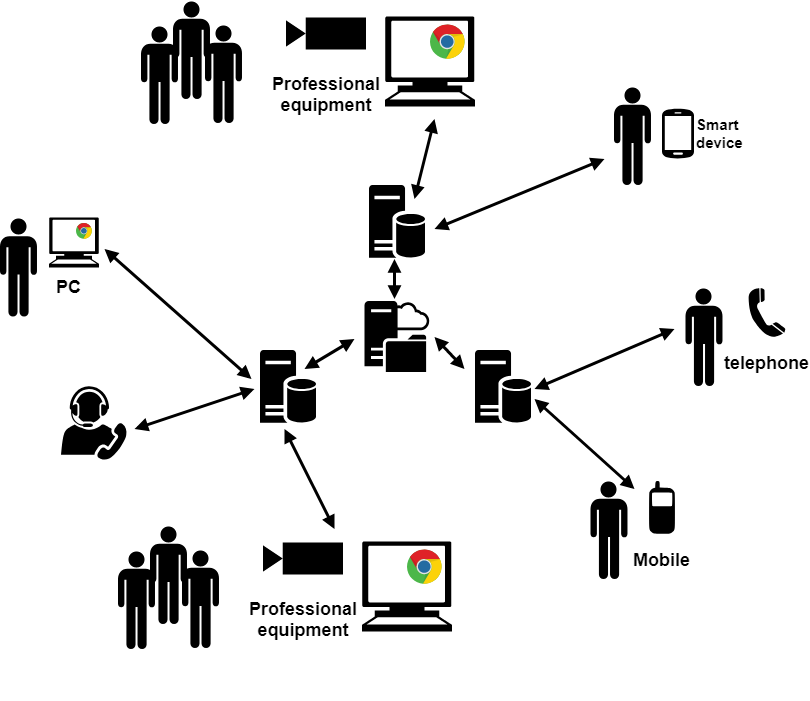
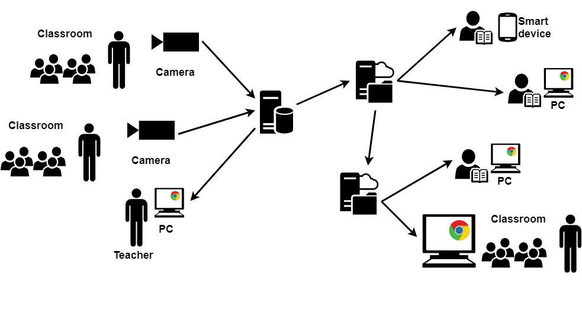
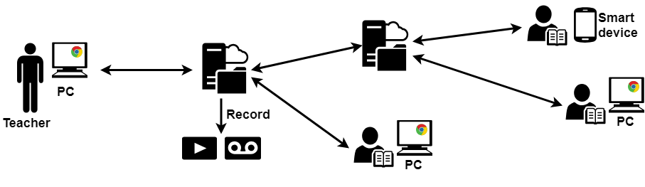
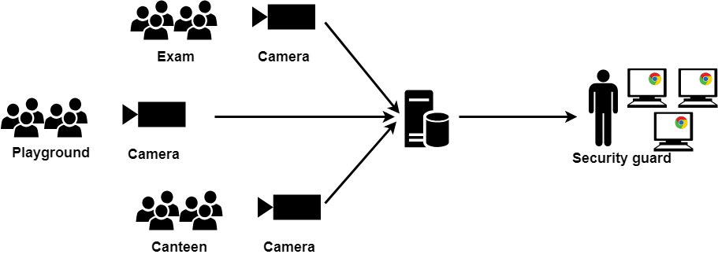

# Real-Time Communication
Real-time communication is playing a much more important role in our daily life nowadays. It not only includes the telephony in the conventional sense, but also contains mobile and cellular telephone, IM (instant messaging), VoIP (Voice over IP, also called Internet telephone), IRC (Internet Relay Chat) or other chatting modes and so on. There is a significant delay between the transmission and the receipt of the information when communicating in timeshifting mode, such as leaving messages by email, on a bulletin board or on a blog. While real-time communication shares information and interacts with people through network connections just as if they were face-to-face. It’s usually a peer-to-peer connection with minimal latency. Moreover, the growing demands for real-time communications with high quality arouse many new multimedia technologies. These newly developed technologies and solutions give users better experience and also help traditional industries evolve and become more competitive. And webstreamer is a multimedia solution to make real-time communications via web much easier. Here, we list several application scenarios which could be implemented by webstreamer.  

## Corporate collaboration

*   **Video conferencing**  
    Video conferencing is a very typical application scenario. It shows improved efficiency and lower costs of time and transportation. Video, audio, text, screen sharing and mobile access are supported. Paticipants could use PC camera, mobile phone or special equipment to capture video/audio of themselves. All participants could see each other or only the speaker could been seen, it's up to the MCU and can be custom designed.

    

*   **Video customer service**  
    After sales service, complaint and purchase enquiry could be done totally online. Consumers communicate directly with customer service.

## Education

*   **Live classroom**  
    The classroom teaching could be broadcast online for students absent, adults want to study and students from other areas. You can follow the teacher both in local area network and Internet.

    

*   **Interactive teaching**  
    Users interact with teachers via video/audio/text in the scenario of online teaching. Screen and file sharing are also inlcuded. Different from live classroom, it's biodirectional and teachers could received feedback.

    

*   **Safe campus**  
    Security guards patrol via bayonet monitoring system, which keeps the campus safe and sound. The system may detect suspicious person by face recognition and data analysis. It could also manage students's daily activities at campus.

    
## Entertainment

*   **Live broadcast**     
    Traditional live broadcast, such as sports event, Concert and TV serials, is mostly spread on television. But people could view these live broadcast directly on their PC, smart phone or pad in recent years. Streaming media vendors make great contributions to this. They have to distribute their nodes worldwide to provide real-time entertainment show.

    

*   **Face to face chatting**  
    Video/Aduio communication becomes indispensable in our daily life. Different from video conferencing, smart phones are the major equipments and used in various network environments, which might own poor quality of network. Hence, the media solution should adjust the parameters automatically to adapt to these environments. Peer to server to peer model might be more appropriate for this scenario instead of peer to peer.
*   **VR shopping**  
    Consumers select and pick out what they need without at spot. Goods could be displayed by the shopping guide online or tried on via VR technologies. Scenarios inlcude but not limit to clothing, daily necessaries, food and luxury. 
*   **Gaming**  
    Real-time audio chatting is necessary in collaborative game and requires very very low latency. And real-time video interaction is the important part in VR games. Moreover, people can interact and manipulate the remote gaming device without buying the physical entertainment devices.

    

## Finance

*   **Online business**  
    Confirming user identity is the key step in KYC and customer could communicate with bank staff to do business online.

    

*   **Safe bank**  
    Monitoring system analyze the real-time video inside and around the bank to keep it safe. 

    

## Medical treatment
*   **Live surgery**   
    Surgical procedure could be real-time broadcast to experts, so they might know the procedure in time and guide for emergencies. Experts from other hospitals could also participate in the procedure or normal consultation.

    

*   **Remote consultation**  
    Patients, especially old men could communicate with the docters online without line up in hospital. Doctors could give preliminary advice according to the description of the patient's symptom and his test results of community or home medical equipments.  

    

*   **Remote medical education**  
    Medical students could learn some courses or lectures online from experts of other hospitals.  

    

## Government affairs
*   **Security**  
    Monitoring system for transport, school, hospital, comminity and other public utilities is important for keep the urban resident safe and the city operating normally. For example, traffic bureau could take control of the whole transport and use big data analysis to dredge traffic jam appropriately, especially in holiday. And it can guide ambulances and fire trucks smooth traffic routes. Intelligent analysis also improve the efficency of recording illegal traffic vehicles and handling traffic accidents.

    

*   **Trial**  
    During the trial, all the evidences and witness statements could be automatically recorded and transfered to reports material in time by intelligent analysis. Witness absent could also voice his statements via real-time interactive system.

    
