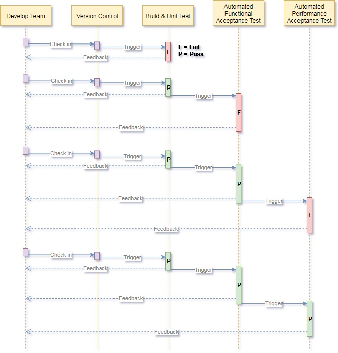
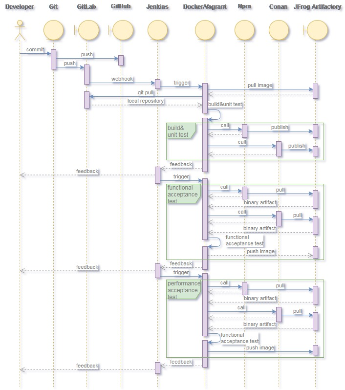
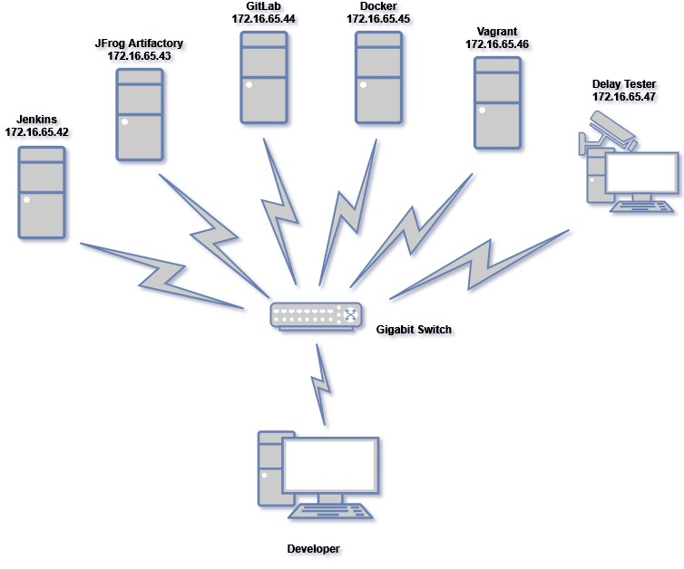

# WebStreamer DevOps Design

## DevOps workflow

## DevOps toolset
1. [Git](https://git-scm.com/) : Free and open-source distributed version control system
2. [GitHub](https://github.com/) : A web-based hosting service for version control using Git
3. [Jenkins](https://jenkins.io/) : The leading open-source automation server for CI/CD
4. [npm](https://www.npmjs.com/) : JavaScript package manager
5. [Conan](https://conan.io/) : C/C++ open-source package manager
6. [Docker](https://www.docker.com/) : Container platform
7. [Vagrant](https://www.vagrantup.com/) : Virtual machine manager
8. [Gitlab](https://about.gitlab.com/) : A self-hosted web-based Git-repository manager
9. [JFrog Artifactory](https://jfrog.com/artifactory/) : Enterprise Universal Repository Manager
10. [VirtualBox](https://www.virtualbox.org/) : Free and open-source hypervisor or virtual machine monitor for x86 computers

## DevOps best practice

## DevOps environment setup
### 1. Hardware configuration

### 2. Software configuration matrix
Software installed \ Service | Jenkins | JFrog Artifactory | GitLab | Docker | Vagrant | Delay Tester
-----------------------------|:-------:|:-----------------:|:------:|:------:|:-------:|:------------:
__Operating System__||||||
ubuntu-16.04.5-server|||__*__|__*__||
Windows 7 Service Pack 1|__*__|__*__|||__*__|
__Tools__||||||
Jenkins 2.121.3|__*__|||||
Git 2.18.0|__*__|||||
Gitlab CE 11.1.4|||__*__|||
Java SE Development Kit 8u181||__*__||||
Google Chrome 68.0||__*__||||
JFrog Artifactory Pro 6.2.0||__*__||||
Docker 18.03.0~ce-0~ubuntu_amd64||||__*__||
Vagrant 2.1.1|||||__*__|
VirtualBox 5.2.12|||||__*__|
Windows PowerShell 3.0|||||__*__|

## DevOps software environment configuration matrix
Software installed \ Worker image | Ubuntu16.04   | Windows7
:----------------------------------|:-------------:|:---------:
__Operating System__||
ubuntu-16.04.5-desktop|__*__|
Windows 7 Service Pack 1||__*__
__PowerShell__||
Windows PowerShell 5.1||__*__
__.Net Framework__||
.Net Framework 4.7.2||__*__
__Visual Studio 2015__||
Visual Studio Community 2015 with Update 3||__*__
__Version Control__||
Git 2.18.0|__*__|__*__
Git Large File Storage 2.5.1|__*__|__*__
__Node.js__||
Node.js 8.11.4 LTS|__*__|__*__
__Python__||
Python 2.7.15|__*__|__*__
Python 3.7.0|__*__|__*__
__Selenium__||
[Google ChromeDriver 2.41](https://sites.google.com/a/chromium.org/chromedriver/downloads)|__*__|__*__
[Firefox GeckoDriver 0.21.0](https://github.com/mozilla/geckodriver/releases)|__*__|__*__
__Web Browser__||
Chrome 68.0|__*__|__*__
Firefox 61.0.2|__*__|__*__
__Tools__||
CMake 3.12.1|__*__|__*__