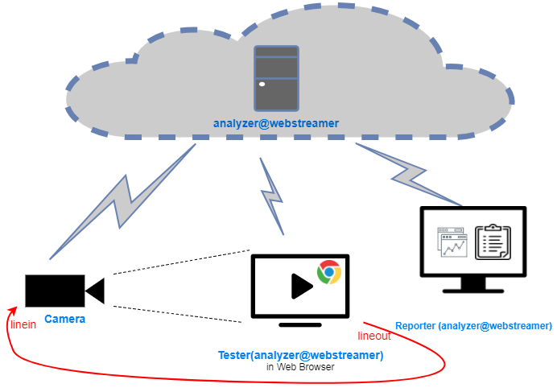

# anlaysis of audio/video stream

a typical test enviroment as below

F1) audio validate

F2) video validate

F3) audio and video sync check

F4) video rendering time (the duration between video generate and display in chrome,finally)

